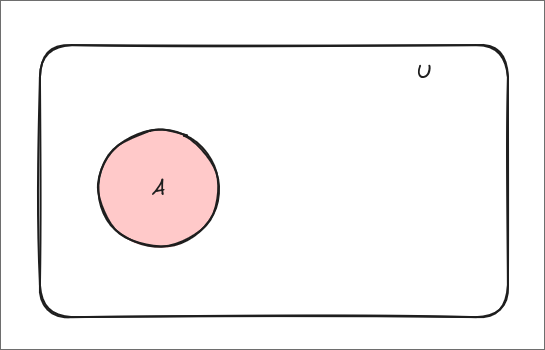

# Table of Contents 

<!-- vim-markdown-toc GFM -->

* [Set Theory](#set-theory)
    * [Declaring Sets](#declaring-sets)
    * [Comparing Sets](#comparing-sets)
* [Union of Sets](#union-of-sets)
* [Intersection of Sets](#intersection-of-sets)
* [Compliments](#compliments)
* [Properties](#properties)

<!-- vim-markdown-toc -->

# Set Theory 

$\mathbb{U}$ denotes the universal set - it consists of all objects under study 

Example:
* $\mathbb{R}$: is the universal set in Calculus
* $\emptyset$ is the empty set
* Venn Diagram - pictoral way of describing sets

## Declaring Sets

Recall two ways of writing a set 
* 1. $A={...}$ (list of all obj)
* 2. $A={x\in U | ... }$ where ... represents a condition 

Example: $A = {x \in \mathbb{R} | x^=1}={1,-1}$

## Comparing Sets

Let A and B be two sets in U

$A \subseteq B \leftrightarrow \forall x \in A, x \in B$

If $A \subseteq B$ we say that B is a *superset* of A (with notation $B \supseteq A$

We say that sets A and B are equal iff $A \subseteq B \land B \subseteq A$ 

Example: $\{1,2\}=\{1,1,2,2,2\}$

**Observe**: While writing a set, you may repeat an object

# Union of Sets 

For sets A and B within U an object is in the union of A and B iff that object is either in A or B

Example: 
* $A \cup A = A$ 
* $A \cup B = B \cup A$ 

# Intersection of Sets

For sets A and B within U an object is in the intersection of A and B iff that object is either in A and B

Ex: if $A=\{0,1\},B=\{1,2,3\}$ then $A \cap B = \{1\}$

# Compliments 

For sets A and B within U an object is  the $complements$ of A and B iff the object is in A and not in B

Ex: if $A=\{0,1\},B=\{1,2,3\}$ then $=\{0\} = A \backslash B = x \in A \land x \not \in B$

Notation: $A^c = U \backslash A$ 

# Properties 

  <h2>Commutative Properties:</h2>

 
$$A \cup B = B \cup A$$
$$A \cap B = B \cap A$$

  <h2>Associative Property</h2>

$$A \cup (B \cup C) = (A \cup B) \cup C$$

